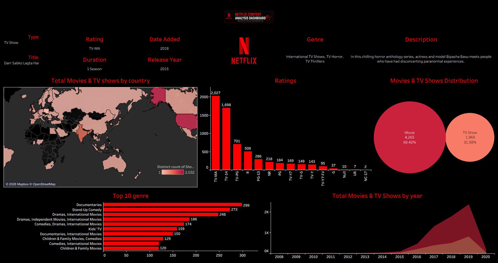

# 🎬 Netflix Content Analysis Dashboard

> An interactive Tableau dashboard that explores Netflix's global content library through powerful visualizations, revealing insights into content distribution, ratings, genres, countries, and release trends.

---

## 📖 Project Overview

This project was created while learning **Tableau** to strengthen my data visualization and dashboard development skills.

Using the Netflix Titles dataset, I designed an interactive dashboard that transforms raw data into meaningful business insights. The dashboard enables users to explore Netflix's content catalog based on country, ratings, genres, release years, and content type.

The goal of this project was to practice dashboard design, data storytelling, and business intelligence concepts while creating an informative and visually appealing analytics dashboard.

---

## 🎯 Objectives

- Analyze Netflix's global content distribution.
- Compare Movies and TV Shows available on Netflix.
- Identify the most common content ratings.
- Explore the most popular genres.
- Understand Netflix's yearly content growth.
- Visualize country-wise content availability.

---

# 📊 Dashboard Preview

<p align="center">
  
</p>

---

## 📈 Dashboard Features

### 🌍 Global Content Distribution
- Interactive world map displaying Netflix content by country.
- Highlights countries with the highest number of titles.

### 🎥 Content Type Analysis
- Comparison between Movies and TV Shows.
- Shows the proportion of each content type.

### ⭐ Ratings Distribution
Analyze the distribution of ratings including:

- TV-MA
- TV-14
- TV-PG
- PG-13
- R
- PG
- NR
- TV-Y
- TV-G
- and more.

### 🎭 Top Genres
Displays the ten most common genres available on Netflix, helping identify the platform's dominant content categories.

### 📅 Year-wise Content Growth
Shows how Netflix's content library has expanded over time, highlighting major growth periods.

### 📄 Content Information Panel
Displays detailed information for the selected title, including:

- Title
- Type
- Rating
- Genre
- Release Year
- Date Added
- Duration
- Description

---

# 💡 Key Insights

- 🎬 Movies dominate Netflix's content library.
- ⭐ TV-MA is the most common content rating.
- 🌎 Netflix content is distributed across countries worldwide.
- 🎭 Documentaries and International Movies are among the most popular genres.
- 📈 Netflix experienced rapid catalog growth after 2016, reaching its peak around 2019.

---

# 🛠️ Tools & Technologies

- Tableau
- Microsoft Excel / CSV Dataset
- Data Cleaning
- Data Visualization
- Dashboard Design

---

# 📂 Dataset

The dashboard is built using the **Netflix Titles Dataset**, which contains information such as:

- Title
- Type
- Country
- Director
- Cast
- Rating
- Genre
- Release Year
- Date Added
- Duration
- Description

---

# 🧠 Skills Demonstrated

- Tableau Dashboard Development
- Data Visualization
- Business Intelligence
- Data Storytelling
- Interactive Dashboard Design
- Geographic Mapping
- Trend Analysis
- Dashboard Formatting
- Data Cleaning

---

# 🚀 Learning Outcomes

Through this project, I learned how to:

- Design interactive dashboards in Tableau.
- Transform raw datasets into meaningful insights.
- Build business-focused visualizations.
- Choose effective chart types for different analyses.
- Create dashboards with improved usability and aesthetics.

---

# 📁 Project Structure

```
Netflix-Content-Analysis-Dashboard/
│
├── Dashboard/
│   └── Netflix Dashboard.twb
│
├── Dataset/
│   └── netflix_titles.csv
│
├── Images/
│   └── dashboard.png
│
└── README.md
```

---

# 🔮 Future Improvements

- Add interactive dashboard filters.
- Create KPI summary cards.
- Publish the dashboard on Tableau Public.
- Improve dashboard responsiveness.
- Enhance overall UI/UX design.

---

## 👩‍💻 Author

**Anshika Maurya**

🎓 B.Sc. Information Technology Student

📊 Aspiring Data Analyst

### Skills

- Tableau
- SQL
- Python
- Excel
- Data Visualization

---

## ⭐ Support

If you found this project useful, consider giving it a **⭐ Star** on GitHub.

It motivates me to build and share more data analytics projects!